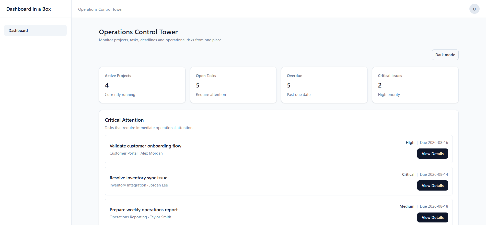
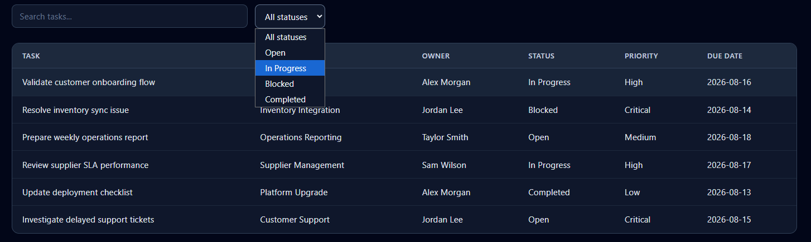
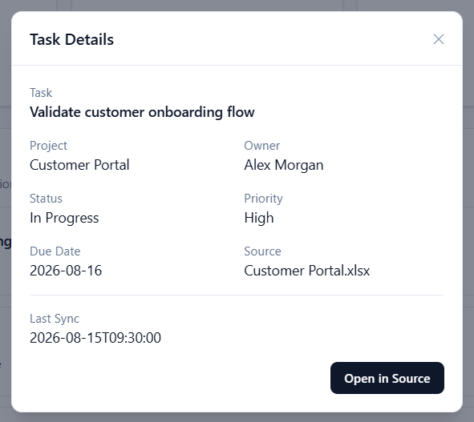
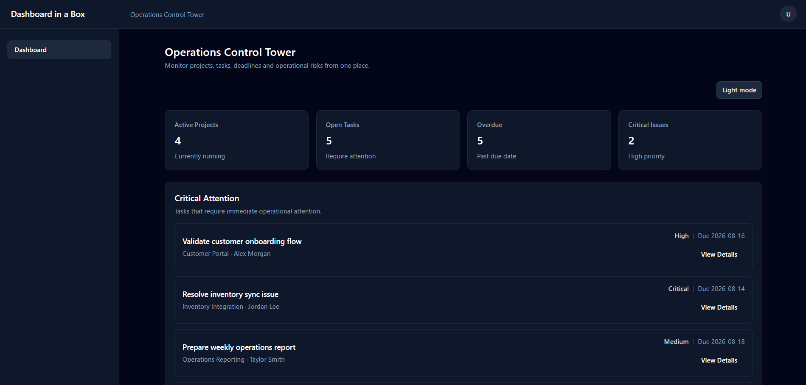
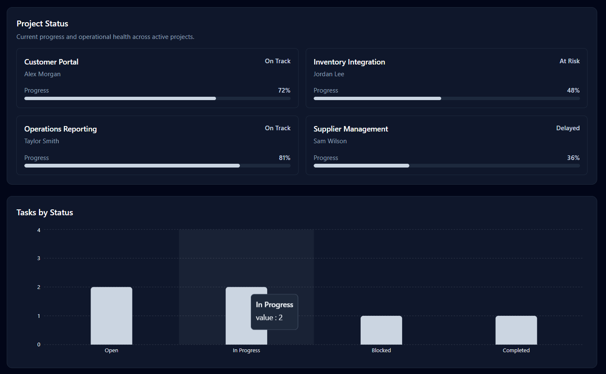
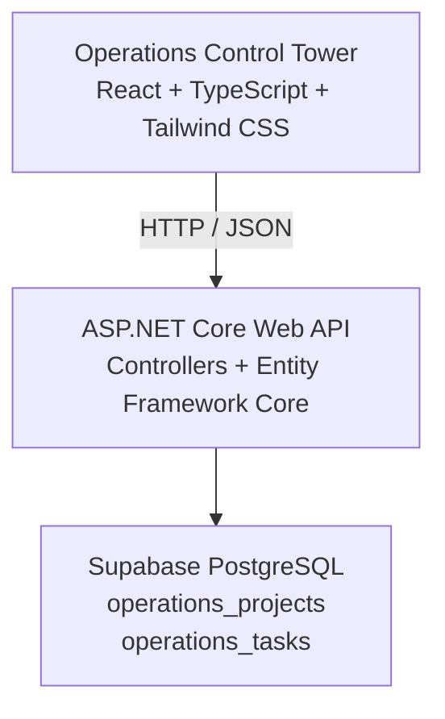
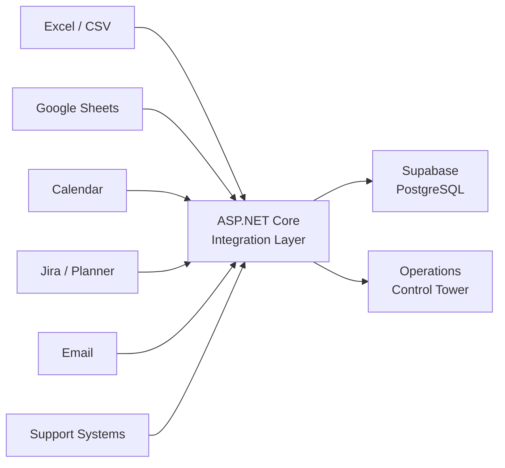

# Dashboard in a Box

🇮🇱 עברית | [🇬🇧 English](README.md)

**Management Dashboards & Command Centers**

> הפיכת מידע מפוזר ותהליכים מורכבים למערכות ניהול ברורות, ויזואליות וניתנות לפעולה.

---

## פרויקט Portfolio מרכזי — Operations Control Tower

**Operations Control Tower** הוא Dashboard ניהולי Full Stack שנועד לתת למנהלים תמונת מצב תפעולית ברורה של פרויקטים, משימות, מועדי יעד, עדיפויות ונושאים הדורשים תשומת לב.

במקום להחליף את הכלים שבהם הארגון כבר משתמש, המערכת משמשת כ־**שכבת ניהול מעל המערכות הקיימות**, ומרכזת מידע תפעולי לתמונה אחת ממוקדת.

גרסת ה־Portfolio הנוכחית בנויה באמצעות:

**React + TypeScript + Tailwind CSS → ASP.NET Core Web API → Supabase PostgreSQL**

---

## הבעיה

בארגונים רבים המידע כבר קיים, אך הוא מפוזר בין:

* Excel ו־Google Sheets
* מסמכים וקבצים מקומיים
* Email
* Calendars
* מערכות ענן
* כלי ניהול פרויקטים
* מערכות תפעול ו־Support

התוצאה היא תהליכי עבודה מפוצלים, מעקב ידני, חוסר בתמונת מצב וקושי להבין את התמונה הרחבה.

**האתגר אינו רק לאסוף יותר מידע — אלא להפוך את המידע שכבר קיים לתמונה ניהולית ברורה.**

---

## הפתרון

Dashboard in a Box יוצר שכבת ניהול שמחברת מידע ותהליכים ממערכות קיימות ומציגה אותם כתמונה תפעולית אחת.

המטרה היא לאפשר למנהל להבין במהירות:

* מה קורה כרגע?
* מה דורש תשומת לב?
* מה באיחור?
* מי אחראי על כל משימה?
* מאיזו מערכת הגיע המידע?
* עד כמה המידע עדכני?

המערכת נועדה להשלים את הכלים הקיימים — לא להחליף אותם.

---

## Operations Control Tower — יכולות קיימות

### Dashboard ניהולי

* תמונת KPI תפעולית

  * Active Projects
  * Open Tasks
  * Overdue Tasks
  * Critical Issues
* אזור Critical Attention
* תצוגת Project Status
* גרף Tasks by Status

### משימות תפעוליות

* טבלת Tasks
* Project
* Owner
* Status
* Priority
* Due Date
* Source System
* Last Sync

### חיפוש וסינון

* חיפוש חופשי במשימות
* סינון לפי Status
* עדכון תצוגת ה־Dashboard בהתאם לנתונים המסוננים

### Task Details

* תצוגת פרטי משימה
* מידע על מקור הנתונים
* Last Sync
* אינטראקציית Demo של `Open in Source`

### Full Stack

* ASP.NET Core Web API
* Supabase PostgreSQL
* Entity Framework Core
* Projects API
* Tasks API
* טעינת נתונים מה־Backend
* Loading State
* Error State

### UI / UX

* Layout רספונסיבי
* רכיבי UI לשימוש חוזר
* KPI Cards
* Charts
* Tables
* Forms ו־Inputs
* Modal interactions
* Notifications
* Light Mode
* Dark Mode

---

## Screenshots

### Dashboard Overview — Light Mode

תמונת מצב תפעולית הכוללת KPIs, משימות הדורשות תשומת לב, סטטוס פרויקטים ומעקב אחר משימות.



### Operational Tasks

חיפוש, סינון וצפייה במשימות לפי Project, Owner, Status, Priority ו־Due Date.



### Task Details

תצוגת פרטי משימה הכוללת Project, Owner, Status, Priority, Due Date, Source System ו־Last Sync.



### Dashboard Overview — Dark Mode

אותה חוויית ניהול זמינה גם ב־Dark Mode מלא וקריא.



### Project Status — Dark Mode

תצוגת התקדמות ובריאות תפעולית של הפרויקטים יחד עם המחשת סטטוס המשימות.



---

## Architecture

### הארכיטקטורה הנוכחית



ה־Frontend מתקשר עם ASP.NET Core API ואינו ניגש ישירות ל־Supabase.

כך נשמרת שכבת לוגיקה מרכזית, ונוצרת נקודת חיבור טבעית למקורות מידע חיצוניים בעתיד.

### כיוון אינטגרציה עתידי



האינטגרציות האלו מייצגות את כיוון הארכיטקטורה העתידי והן **אינן ממומשות עדיין**.

---

## החלטות טכנולוגיות ומוצריות

### Backend-first architecture

React מתקשר עם ASP.NET Core ולא ישירות עם Supabase.

כך ניתן לרכז את הגישה לנתונים ואת הלוגיקה במקום אחד, וליצור שכבת Integration עבור מערכות חיצוניות בעתיד.

### PostgreSQL באמצעות Supabase

Supabase מספק סביבת PostgreSQL מנוהלת, תוך שמירה על ארכיטקטורת Database רלציונית סטנדרטית.

כיום קיימות שתי טבלאות מרכזיות:

* `operations_projects`
* `operations_tasks`

### שכבת ניהול ולא מערכת חלופית

Operations Control Tower נועד לפעול מעל כלים תפעוליים קיימים.

המטרה אינה לבנות מחדש Jira, Planner, Excel או מערכות Support, אלא להציג למנהל תמונה תפעולית מרוכזת.

### Source-aware data model

כל Task כולל מידע על:

* `Source`
* `Last Sync`

השדות האלו קיימים בכוונה. במערכת המחוברת בעתיד למספר מקורות, חשוב שהמנהל ידע מאיפה הגיע המידע ועד כמה הוא עדכני.

### ללא CRUD מלאכותי

Full CRUD ו־`Add Task` לא נוספו רק כדי להדגים יכולת טכנית.

יכולות חדשות מתווספות כאשר הן משרתות את ה־Use Case הניהולי.

### Dashboard Engine לשימוש חוזר

מבנה ה־UI והארכיטקטורה נועדו לאפשר שימוש חוזר ב־Components ובדפוסים עבור מספר Use Cases ניהוליים.

**One Engine → Multiple Management Use Cases**

---

## Tech Stack

### Frontend

* React
* TypeScript
* Tailwind CSS

### Backend

* ASP.NET Core Web API
* Entity Framework Core
* Npgsql

### Database

* Supabase
* PostgreSQL

---

## API

ה־Backend הנוכחי חושף:

```text
GET /api/projects
GET /api/tasks
```

בסביבת הפיתוח המקומית ה־API רץ ב:

```text
http://localhost:5077
```

ה־Frontend רץ ב:

```text
http://localhost:5173
```

---

## מבנה Repository

```text
dashboard-in-a-box/
├── frontend/
│   └── src/
│       ├── components/
│       ├── pages/
│       ├── services/
│       └── types/
│
├── backend/
│   ├── Controllers/
│   ├── Data/
│   ├── Models/
│   └── Program.cs
│
├── docs/
│   └── screenshots/
├── README.md
├── README.he.md
└── .gitignore
```

---

## הרצה מקומית

### דרישות מוקדמות

* Node.js
* .NET SDK
* גישה ל־PostgreSQL Database המוגדר עבור הפרויקט

### Backend

מתוך תיקיית `backend`:

```bash
dotnet run
```

ה־Database Connection String נשמר באמצעות **.NET User Secrets** ואינו אמור להישמר ב־Git.

### Frontend

מתוך תיקיית `frontend`:

```bash
npm install
npm run dev
```

לאחר מכן ניתן לפתוח:

```text
http://localhost:5173
```

---

## מגבלות נוכחיות

גרסת ה־Portfolio הנוכחית מתמקדת בחוויית ה־Management Dashboard ובארכיטקטורת ה־Full Stack הבסיסית.

המגבלות הנוכחיות:

* אין עדיין Authentication או Role-Based Access
* אין אינטגרציות פעילות ל־Jira, Excel, Planner, Calendar, Email או מערכות Support
* `Open in Source` הוא כרגע Demo interaction
* הגדרת ה־API מבוססת כרגע על סביבת פיתוח מקומית
* אין עדיין Public Deployment
* אין תהליך Refresh או Synchronization אוטומטי
* אין Pagination עבור כמות גדולה של Tasks
* אין עדיין Activity Timeline או Audit History

---

## Dashboard in a Box

Operations Control Tower הוא ה־Primary Portfolio Use Case, אך הוא בנוי כחלק מתפיסה רחבה יותר.

Dashboard in a Box מתמקד בשלושה סוגי מערכות:

### Management Dashboards

תצוגות ניהוליות המבוססות על KPIs, Charts, Tables, Filters, Trends, Reports ו־Alerts.

### Management Interfaces

מערכות פנימיות לניהול מידע, תהליכים, משימות, סטטוסים ו־Workflows ארגוניים.

### Workflow & Command Centers

מערכות המחברות בין:

**Information → Process → Decision → Action**

---

## Portfolio Use Cases

### Operations Control Tower

**פרויקט ה־Portfolio המרכזי**

שכבת ניהול עבור Projects, Tasks, Deadlines, Priorities, Issues ומידע על מקור הנתונים.

### School Management Command Center

**Differentiating Portfolio Use Case**

שכבת ניהול לפעילות ארגונית שאינה מקבלת מענה מספק במערכות הדיווח הבית־ספריות השוטפות.

המערכת נועדה לחבר בין Programs, Meetings, Decisions, Tasks, Documents, Letters ו־Follow-ups וליצור זיכרון ניהולי שניתן לחפש ולעקוב אחריו.

Use Cases נוספים יכולים להיבנות על אותו Dashboard Engine.

---

## סטטוס הפרויקט

### הושלם

* [x] Business Definition
* [x] Repository Foundation
* [x] Dashboard Engine Skeleton
* [x] Reusable UI System
* [x] Operations Control Tower Dashboard
* [x] ASP.NET Core Web API
* [x] Supabase PostgreSQL Database
* [x] Backend → Database Integration
* [x] Frontend → Backend Integration
* [x] Loading and Error States
* [x] Light Mode ו־Dark Mode

### Portfolio Packaging

* [x] Feature Documentation
* [x] Architecture Documentation
* [x] Technical Decisions
* [x] Known Limitations
* [x] Screenshots
* [ ] Public Deployment

---

## הרעיון המרכזי

> אני לא מחליפה את הכלים שהארגון כבר עובד איתם.

> אני בונה שכבת ניהול שמחברת את המידע הקיים, הופכת אותו לתמונה ברורה וויזואלית, ומאפשרת למנהל לראות את התמונה הרחבה ולקבל החלטות מבוססות מידע.
