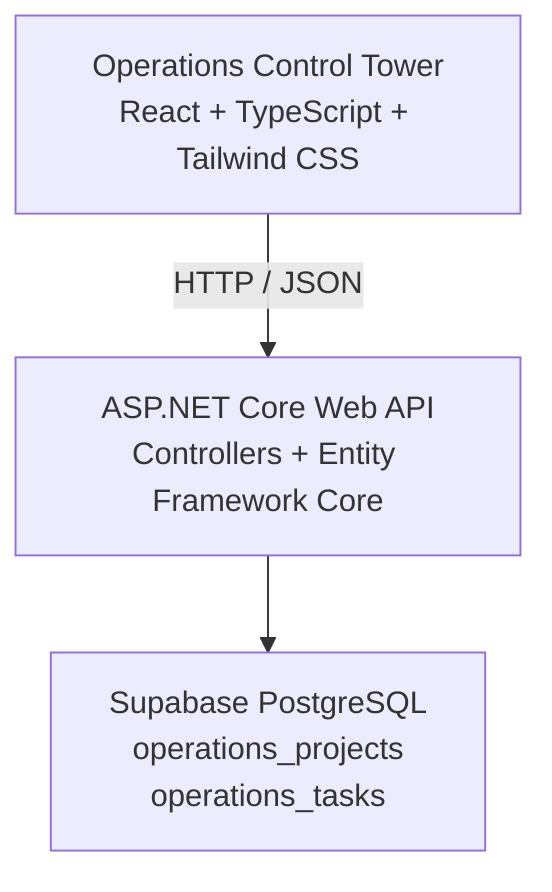
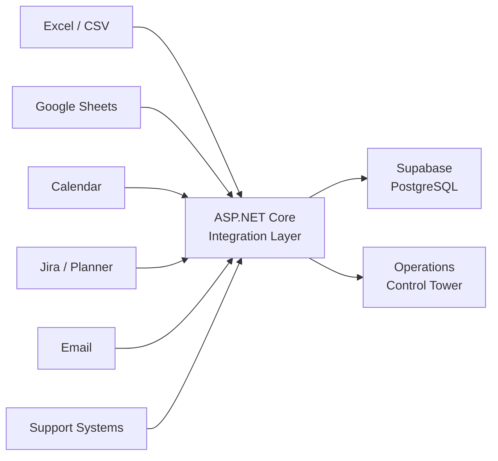

# Dashboard in a Box

[🇮🇱 עברית](README.he.md) | 🇬🇧 English

**Management Dashboards & Command Centers**

> Turn scattered information and complex workflows into clear, actionable management systems.

---

## Featured Portfolio Project — Operations Control Tower

**Operations Control Tower** is a full-stack management dashboard designed to give managers a clear operational picture across projects, tasks, deadlines, priorities, and issues.

Instead of replacing the tools teams already use, it acts as a **management layer above existing systems**, bringing operational information together into one focused view.

The current portfolio version is built with:

**React + TypeScript + Tailwind CSS → ASP.NET Core Web API → Supabase PostgreSQL**

---

## The Problem

Organizations often already have the information they need, but that information is scattered across:

* Excel and Google Sheets
* Documents and local files
* Email
* Calendars
* Cloud applications
* Project-management tools
* Operational and support systems

This creates fragmented workflows, manual tracking, limited visibility, and difficulty understanding the bigger picture.

**The challenge is not simply collecting more data. It is turning existing information into a clear management picture.**

---

## The Solution

Dashboard in a Box creates a management layer that connects information and workflows from existing tools and presents them as one clear operational picture.

The goal is to help managers quickly understand:

* What is happening?
* What requires attention?
* What is overdue?
* Who owns each task?
* Where did the information come from?
* How current is the information?

The system is designed to complement existing tools rather than replace them.

---

## Operations Control Tower — Current Features

### Management Dashboard

* Operational KPI overview

  * Active Projects
  * Open Tasks
  * Overdue Tasks
  * Critical Issues
* Critical Attention view
* Project Status overview
* Tasks by Status visualization

### Operational Tasks

* Tasks table
* Project
* Owner
* Status
* Priority
* Due date
* Source system
* Last synchronization time

### Search & Filtering

* Free-text task search
* Status filtering
* Dashboard updates based on filtered data

### Task Details

* Detailed task view
* Source information
* Last Sync information
* `Open in Source` demo interaction

### Full-Stack Capabilities

* ASP.NET Core Web API
* Supabase PostgreSQL persistence
* Entity Framework Core
* Projects API
* Tasks API
* Frontend data loading through the backend
* Loading state
* Error state

### UI / UX

* Responsive dashboard layout
* Reusable UI components
* KPI cards
* Charts
* Tables
* Forms and inputs
* Modal interactions
* Notifications
* Light Mode
* Dark Mode

---

## Screenshots

### Dashboard Overview — Light Mode

A high-level operational view with KPIs, critical attention items, project status, and task monitoring.


### Operational Tasks

Search, filter, and review operational tasks by project, owner, status, priority, and due date.


### Task Details

Detailed task information including project, owner, status, priority, due date, source system, and last synchronization time.


### Dashboard Overview — Dark Mode

The same management experience is available in a fully supported dark theme.


### Project Status — Dark Mode

Project progress and operational health with task-status visualization.


---

## Architecture

### Current Architecture



The frontend communicates with the ASP.NET Core API rather than accessing Supabase directly.

This keeps application logic centralized and provides a clean integration layer for future external data sources.

### Future Integration Direction



These integrations represent the intended architecture direction and are **not implemented yet**.

---

## Technical Decisions

### Backend-first architecture

React communicates with ASP.NET Core rather than connecting directly to Supabase.

This keeps business logic and data access centralized and creates a natural integration point for future external systems.

### PostgreSQL via Supabase

Supabase provides a managed PostgreSQL environment while preserving a standard relational database architecture.

The current database contains:

* `operations_projects`
* `operations_tasks`

### Management layer, not system replacement

Operations Control Tower is designed to sit above existing operational tools.

The objective is not to recreate Jira, Planner, Excel, support systems, or other source applications, but to provide managers with a consolidated operational view.

### Source-aware data model

Tasks include:

* `Source`
* `Last Sync`

These fields are intentional. In a future multi-system environment, managers need to know both where information originated and how current it is.

### No artificial CRUD

Full CRUD and `Add Task` were intentionally not added simply to demonstrate technical functionality.

Features are added when they support the management use case.

### Reusable Dashboard Engine

The UI foundation and architectural patterns are designed to support multiple management use cases without rebuilding the entire system for each project.

**One Engine → Multiple Management Use Cases**

---

## Tech Stack

### Frontend

* React
* TypeScript
* Tailwind CSS

### Backend

* ASP.NET Core Web API
* Entity Framework Core
* Npgsql

### Database

* Supabase
* PostgreSQL

---

## API

The current backend exposes:

```text
GET /api/projects
GET /api/tasks
```

During local development, the API currently runs at:

```text
http://localhost:5077
```

The frontend runs at:

```text
http://localhost:5173
```

---

## Repository Structure

```text
dashboard-in-a-box/
├── frontend/
│   └── src/
│       ├── components/
│       ├── pages/
│       ├── services/
│       └── types/
│
├── backend/
│   ├── Controllers/
│   ├── Data/
│   ├── Models/
│   └── Program.cs
│
├── docs/
│   └── screenshots/
├── README.md
├── README.he.md
└── .gitignore
```

---

## Running Locally

### Prerequisites

* Node.js
* .NET SDK
* Access to the configured PostgreSQL database

### Backend

From the `backend` directory:

```bash
dotnet run
```

The database connection string is stored using **.NET User Secrets** and must not be committed to Git.

### Frontend

From the `frontend` directory:

```bash
npm install
npm run dev
```

Open:

```text
http://localhost:5173
```

---

## Known Limitations

This portfolio version focuses on the management dashboard experience and the core full-stack architecture.

Current limitations:

* No authentication or role-based access yet
* No live integrations with Jira, Excel, Planner, Calendar, Email, or support systems
* `Open in Source` is currently a demo interaction
* API configuration is currently local-development based
* No public deployment yet
* No automated refresh or synchronization process
* No pagination for large task datasets
* No activity timeline or audit history

---

## Dashboard in a Box

Operations Control Tower is the primary portfolio use case, but it is built on a broader concept.

Dashboard in a Box focuses on three types of systems:

### Management Dashboards

Operational views built around KPIs, charts, tables, filters, trends, reports, and alerts.

### Management Interfaces

Internal systems for managing information, processes, tasks, statuses, and organizational workflows.

### Workflow & Command Centers

Management environments that connect:

**Information → Process → Decision → Action**

---

## Portfolio Use Cases

### Operations Control Tower

**Primary portfolio project**

A management layer for operational projects, tasks, deadlines, priorities, issues, and source-system visibility.

### School Management Command Center

**Differentiating portfolio use case**

A management layer for organizational activity that is not adequately captured by day-to-day school reporting systems.

It is designed to connect programs, meetings, decisions, tasks, documents, letters, and follow-ups into a searchable management history.

Additional use cases can be built on the same Dashboard Engine.

---

## Project Status

### Completed

* [x] Business definition
* [x] Repository foundation
* [x] Dashboard Engine skeleton
* [x] Reusable UI system
* [x] Operations Control Tower dashboard
* [x] ASP.NET Core Web API
* [x] Supabase PostgreSQL database
* [x] Backend → Database integration
* [x] Frontend → Backend integration
* [x] Loading and error states
* [x] Light and Dark Mode

### Portfolio Packaging

* [x] Feature documentation
* [x] Architecture documentation
* [x] Technical decisions
* [x] Known limitations
* [x] Screenshots
* [ ] Public deployment

---

## Core Idea

> I do not replace the tools an organization already uses.

> I build a management layer that connects existing information, turns it into a clear visual picture, and helps managers see the bigger picture and make better-informed decisions.
